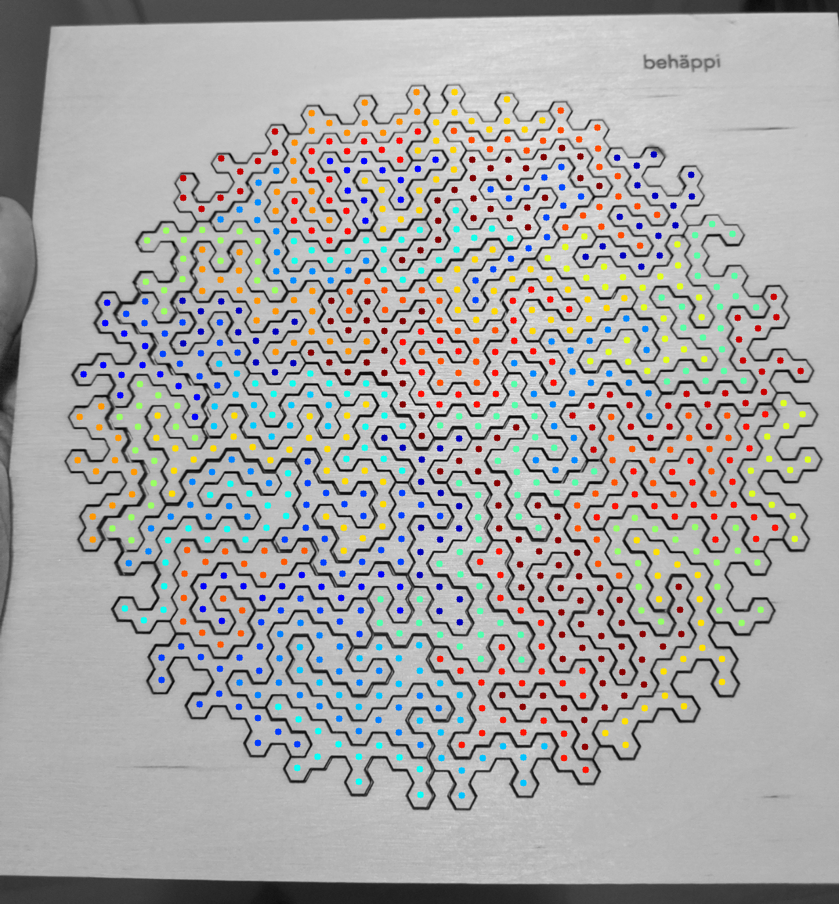
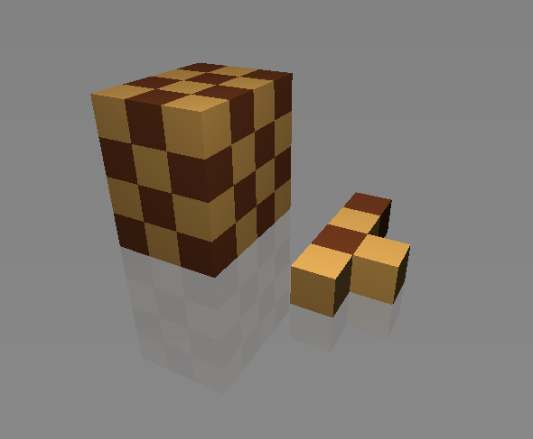
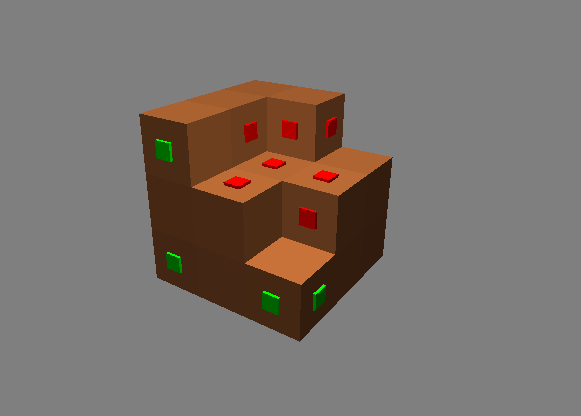

# Algorithmic solutions to physical puzzles

Archive of ad hoc algorithmic solutions to physical puzzle games.
Mostly throwaway-quality code, some of which only runs with Python 2.

## [2019](2019-behappi)

## [2016](http://oseiskar.github.io/puzzles)

## [2010](2010-blocks/bwpalikat.py)

## [2009](2009-wooden-die/puukuutio.py)

