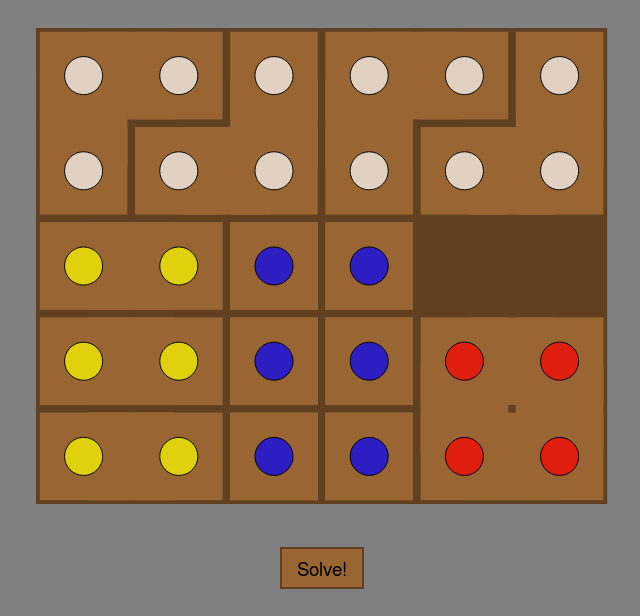

# Algorithmic solutions to physical puzzles

Archive of ad hoc algorithmic solutions to physical puzzle games.
Mostly throwaway-quality code, some of which only runs with Python 2.

## [2019](2019-behappi)

**Python 3 & C++**. Extract piece shapes and layout from photo using computer vision. Find all solutions using brute force depth-first search (DFS) in C++.

## [2016](http://oseiskar.github.io/puzzles)

**JavaScript**. Solve puzzle using A* with Fibonacci heap, HTML visualization.

## [2010](2010-blocks/bw-palikat.py)

**Python 2**. Solve the puzzle using brute force DFS.
OpenGL visualization with Pygame.

## [2009](2009-wooden-die/puukuutio.py)

**Python 2**. Solve the puzzle using brute force DFS.
OpenGL visualization with Pygame.

